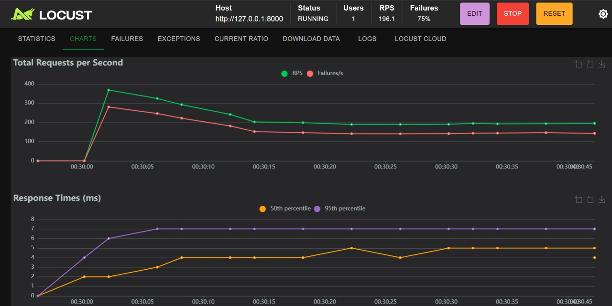

# 🚀 HTTP-Сервер на Python с поддержкой GET/HEAD

Простой асинхронный HTTP-сервер, поддерживающий методы `GET` и `HEAD`, написанный на Python с использованием `asyncio`. В проекте реализована кроссплатформенная поддержка, автоматизация через `Makefile`, проверка кода и нагрузочное тестирование.

---

## 🧱 Архитектура проекта

```
http-server/
├── server/
│   ├── http_server.py        # Асинхронный сервер
│   ├── request_handler.py    # Обработка запросов
│   └── utils.py              # Утилиты (MIME, пути)
├── www/
│   ├── index.html            # Пример файла
│   └── style.css             # Дополнительный файл
├── tests/
│   ├── functional/           # Функциональные тесты
│   └── load/                 # Нагрузочные тесты
├── run_server.py             # Точка входа
├── Makefile                  # Автоматизация задач
├── pyproject.toml            # Управление зависимостями (Poetry)
└── README.md
```

---

## 📦 Установка

1. Клонируйте репозиторий:
```bash
git clone https://github.com/yourname/http-server.git
cd http-server
```

2. Установите зависимости:
```bash
poetry install
```

3. Убедитесь, что есть файлы в папке `www/`.

---

## ▶️ Запуск сервера

```bash
make server
```

Сервер будет доступен по адресу: `http://127.0.0.1:8000`

---

## 🧪 Функциональное тестирование

Запустите тесты, которые проверяют корректность работы методов `GET` и `HEAD`:

```bash
make test
```

Тесты проверяют:
- Ответ `200 OK` для существующих файлов
- Пустое тело для `HEAD`-запросов
- Ответ `404 Not Found` для несуществующих файлов

---

## ⚙️ Проверка качества кода

### 1. Форматирование кода:
```bash
make format
```

### 2. Проверка стиля:
```bash
make lint
```

### 3. Полная проверка:
```bash
make check
```

---

## 🧱 CI/CD

Проект интегрирован с GitHub Actions. При каждом пуше в ветку `main` выполняются:

- Проверка стиля (`flake8`)
- Функциональные тесты
- Нагрузочное тестирование


---

## 🧵 Нагрузочное тестирование

Сервер протестирован с помощью `locust`. Можно запустить нагрузочный тест локально:

```bash
make loadtest
```

Откройте браузер по адресу:
```
http://localhost:8089
```

И начните тестирование:
- Укажите количество пользователей
- Скорость создания пользователей
- Время выполнения


---
